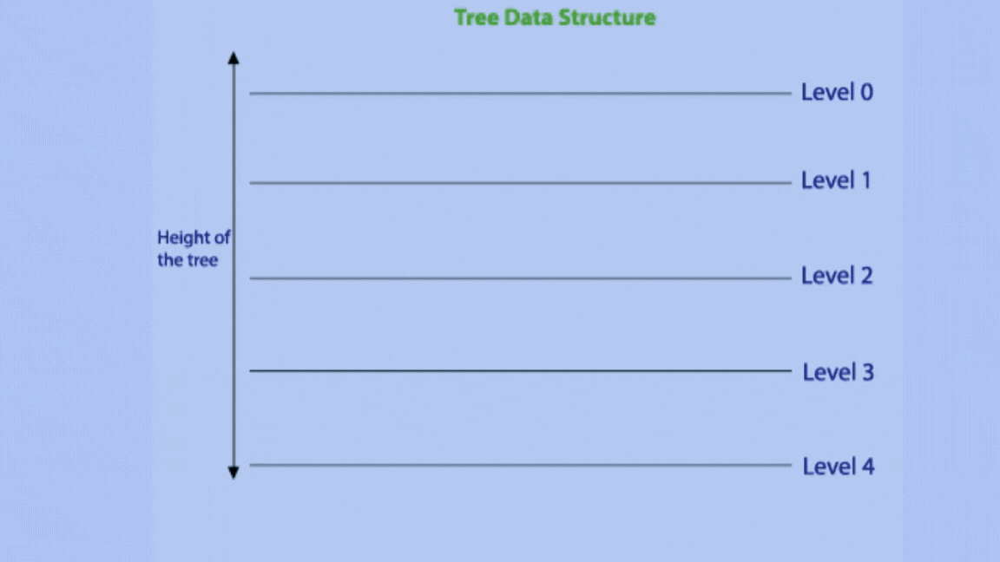

# The Binary Tree

<h3>Description:-</h3>

A binary tree is a type of tree data structure in which each node can have at most two child nodes, known as the left child and the right child. Each node of the tree consists of – data and pointers to the left and the right child.

# Properties of a Binary Tree

The following are some of the important properties of a binary tree:

<ul>
    <li>The maximum number of edges between the root and a leaf node determines the height of a binary tree.</li>
    <li>A binary tree can have a maximum of 2d nodes at depth d.</li>
    <li>A binary tree of height h can have a maximum of 2(h+1) – 1 nodes</li>
    <li>In a binary tree, there can only be as many leaf nodes as internal nodes plus one</li>
</ul>

<h3>Advantages of binary tree:-</h3>

<ul>
    <li>
    Effective searching and sorting: Binary trees are useful in a variety of applications because they offer effective searching and sorting operations.
    </li>
    <li>
    Memory efficiency: Because binary trees use less memory than other tree structures like multi-way trees or linked lists, they are a viable option for huge data sets.
    </li>
    <li>
    Fast insertion: As we know only a portion of the tree needs to be updated therefore binary trees enable fast element insertion.
    </li>
</ul>

<h3>Disadvantages of binary tree:-</h3>

<ul>
    <li>Limited structure: Binary trees can only have two child nodes per node, which can restrict their versatility and usefulness in some applications.
    </li>
    <li>Difficult to implement: It needs close attention to the node ordering and tree structure, implementing a binary tree can be difficult.
    </li>
    <li>Inefficient for some operations: Some of the operations like finding the minimum or maximum value in a binary tree, can be less efficient and require additional steps and complexity to perform.
    </li>
</ul>